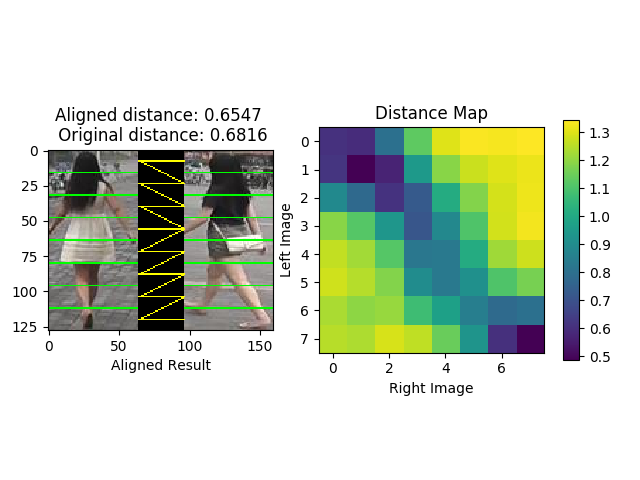

# AlignedReID++ (Pattern Recognition)
Alignedreid++: Dynamically Matching Local Information for Person Re-Identification.
[[PDF]](https://www.sciencedirect.com/science/article/pii/S0031320319302031?via%3Dihub#!)

```
@article{luo2019alignedreid++,
  title={AlignedReID++: Dynamically matching local information for person re-identification},
  author={Luo, Hao and Jiang, Wei and Zhang, Xuan and Fan, Xing and Qian, Jingjing and Zhang, Chi},
  journal={Pattern Recognition},
  volume={94},
  pages={53--61},
  year={2019},
  publisher={Elsevier}
}

@article{zhang2017alignedreid,
  title={Alignedreid: Surpassing human-level performance in person re-identification},
  author={Zhang, Xuan and Luo, Hao and Fan, Xing and Xiang, Weilai and Sun, Yixiao and Xiao, Qiqi and Jiang, Wei and Zhang, Chi and Sun, Jian},
  journal={arXiv preprint arXiv:1711.08184},
  year={2017}
}
```

# Version
Python2/Python3

torch0.4.0

torchvision0.2.1

Now, we support ResNet, ShuffleNet, DenseNet and InceptionV4.

## Demo




## Have a try

Your can test the demo with your own model and datasets. You should change the path of the model and images by manually. The default model is ResNet50 for Market1501.
```bash
python Alignedreid_demo.py
```

## Results (rank1/mAP)　and models

#### Market1501
| Model |  Loss | Global | Local | DMLI | Global+DMLI | Global+DMLI(RK) |Download|
| --- | :---: | :---: | :---: | :---: | :---: | :---: | :---: |
| Resnet50 | Alignedreid | 89.2/75.9 | 90.7/75.5 | 91.1/77.4 | 91.0/77.6 | 92.0/88.5 | [model](https://pan.baidu.com/s/1Zbx_K2Cm1cgUUTNYJRImMA) |
| Resnet50 | Alignedreid(LS) | 90.6/77.7 | 91.4/76.7 | 91.9/78.8 | 91.8/79.1 | 92.8/89.4 | [model](https://pan.baidu.com/s/12JHXjGMzdEv6BsNhpeMYbQ) |

#### DukeMTMCReID
| Model |  Loss | Global | Local | DMLI | Global+DMLI | Global+DMLI(RK) |Download|
| --- | :---: | :---: | :---: | :---: | :---: | :---: | :---: |
| Resnet50 | Alignedreid | 79.3/65.6 | 80.9/66.9 | 81.0/67.7 | 80.7/68.0 |  85.2/81.2  |[model](https://pan.baidu.com/s/1RJg7cU1QKdGKJsndJU3dlA)|
| Resnet50 | Alignedreid(LS) | 81.2/67.4 | 81.5/68.4 | 81.8/69.4 | 82.1/69.7 | 86.2/82.8 |[model](https://pan.baidu.com/s/1CW-ii3lpYnlX7n-JppliVw) |

#### CUHK03
| Model |  Loss | Global | Local | DMLI | Global+DMLI | Global+DMLI(RK) |Download|
| --- | :---: | :---: | :---: | :---: | :---: | :---: | :---: |
| Resnet50 | Alignedreid | 60.7/58.4 | 60.2/58.2 | 60.9/59.6 | 60.9/59.7 | 67.6/70.7 |[model](https://pan.baidu.com/s/1YI8gs_SnoKfWnQyU-HrK8g)|
| Resnet50 | Alignedreid(LS) | 59.7/58.1 | 59.9/57.2 | 61.1/59.4 | 61.5/59.6 | 67.9/70.7 |[model](https://pan.baidu.com/s/1AVxGRBhucNUfUYTeIXyP9A) |

#### MSMT17
| Model |  Loss | Global | Local | DMLI | Global+DMLI |Download|
| --- | :---: | :---: | :---: | :---: | :---: | :---: | 
| Resnet50 | Alignedreid | 63.4/38.4 | 63.8 | 66.3/40.2 | 66.3/40.6 |[model](https://pan.baidu.com/s/1E7rV4PCDoDmAIWjwBnclwg)|
| Resnet50 | Alignedreid(LS) | 67.6/41.8 | 67.3/38.4| 69.6/43.3 | 69.8/43.7 |[model](https://pan.baidu.com/s/1D46g8D_OvnUfu43cWKK83Q) |


#### Market1501-Partial
| Model |  Loss | Global | Local | DMLI | 
| --- | :---: | :---: | :---: | :---: | 
| Resnet50 | Softmax | 59.0/46.4 | 56.5/43.7 | 63.3/50.0 | 
| Resnet50 | Softmax+TriHard | 62.4/49.7 | 51.8/37.6 | 68.0/52.7 |
| Resnet50 | Alignedreid | 65.9/53.5 | 52.8/38.1 | 70.1/55.3 | 

#### DukeMTMCReID-Partial
| Model |  Loss | Global | Local | DMLI | 
| --- | :---: | :---: | :---: | :---: | 
| Resnet50 | Softmax | 45.9/34.7 | 48.6/36.1 | 53.6/40.6 | 
| Resnet50 | Softmax+TriHard | 47.8/36.4 | 43.3/31.5 | 53.7/40.5 |
| Resnet50 | Alignedreid | 49.8/38.2 | 44.8/33.3 | 55.3/42.8 | 

You can download the models on [Google Drive](https://drive.google.com/open?id=1-QApSAY51NvRcQgyUxCn8lP1sSWCeMVg).

# Prepare data
Create a directory to store reid datasets under this repo via
```bash
cd AlignedReID/
mkdir data/
```

If you wanna store datasets in another directory, you need to specify `--root path_to_your/data` when running the training code. Please follow the instructions below to prepare each dataset. After that, you can simply do `-d the_dataset` when running the training code. 

**Market1501** :
1. Download dataset to `data/` from http://www.liangzheng.org/Project/project_reid.html.
2. Extract dataset and rename to `market1501`. The data structure would look like:
```
market1501/
    bounding_box_test/
    bounding_box_train/
    ...
```
3. Use `-d market1501` when running the training code.

**CUHK03** [13]:
1. Create a folder named `cuhk03/` under `data/`.
2. Download dataset to `data/cuhk03/` from http://www.ee.cuhk.edu.hk/~xgwang/CUHK_identification.html and extract `cuhk03_release.zip`, so you will have `data/cuhk03/cuhk03_release`.
3. Download new split [14] from [person-re-ranking](https://github.com/zhunzhong07/person-re-ranking/tree/master/evaluation/data/CUHK03). What you need are `cuhk03_new_protocol_config_detected.mat` and `cuhk03_new_protocol_config_labeled.mat`. Put these two mat files under `data/cuhk03`. Finally, the data structure would look like
```
cuhk03/
    cuhk03_release/
    cuhk03_new_protocol_config_detected.mat
    cuhk03_new_protocol_config_labeled.mat
    ...
```
4. Use `-d cuhk03` when running the training code. In default mode, we use new split (767/700). If you wanna use the original splits (1367/100) created by [13], specify `--cuhk03-classic-split`. As [13] computes CMC differently from Market1501, you might need to specify `--use-metric-cuhk03` for fair comparison with their method. In addition, we support both `labeled` and `detected` modes. The default mode loads `detected` images. Specify `--cuhk03-labeled` if you wanna train and test on `labeled` images.


**DukeMTMC-reID** [16, 17]:
1. Create a directory under `data/` called `dukemtmc-reid`.
2. Download dataset `DukeMTMC-reID.zip` from https://github.com/layumi/DukeMTMC-reID_evaluation#download-dataset and put it to `data/dukemtmc-reid`. Extract the zip file, which leads to
```
dukemtmc-reid/
    DukeMTMC-reid.zip # (you can delete this zip file, it is ok)
    DukeMTMC-reid/ # this folder contains 8 files.
```
3. Use `-d dukemtmcreid` when running the training code.


**MSMT17** [22]:
1. Create a directory named `msmt17/` under `data/`.
2. Download dataset `MSMT17_V1.tar.gz` to `data/msmt17/` from http://www.pkuvmc.com/publications/msmt17.html. Extract the file under the same folder, so you will have
```
msmt17/
    MSMT17_V1.tar.gz # (do whatever you want with this .tar file)
    MSMT17_V1/
        train/
        test/
        list_train.txt
        ... (totally six .txt files)
```
3. Use `-d msmt17` when running the training code.


# Train
Since the performance of Market1501 and DukeMTMCReID is too high, we suggest to using CUHK03 and MSMT17 for future research.

```bash
python train_alignedreid.py  -d cuhk03 -a resnet50 --test_distance global_local --reranking (--labelsmooth)
```

**Note:** You can add your experimental settings for 'args'
# Test

#### Global+Local(DMLI)
```bash
python train_alignedreid.-d cuhk03 -a resnet50 --evaluate --resume YOUR_MODEL_PATH --save-dir log/resnet50-cuhk03-alignedreid --test_distance global_local (--reranking)
```
#### Local(DMLI)
```bash
python train_alignedreid.py -d cuhk03 -a resnet50 --evaluate --resume YOUR_MODEL_PATH --save-dir log/resnet50-cuhk03-alignedreid --test_distance local (--reranking)
```
#### Local(Without DMLI)
```bash
python train_alignedreid.py -d cuhk03 -a resnet50 --evaluate --resume YOUR_MODEL_PATH --save-dir log/resnet50-cuhk03-alignedreid --test_distance local --unaligned (--reranking)
```
#### Global
```bash
python train_alignedreid.py -d cuhk03 -a resnet50 --evaluate --resume YOUR_MODEL_PATH --save-dir log/resnet50-cuhk03-alignedreid --test_distance global (--reranking)
```

**Note:** (--reranking) means whether you use 'Re-ranking with k-reciprocal Encoding (CVPR2017)' to boost the performance.

## Test on Partial ReID

```bash
scp -r data/market1501 data/market1501-partial
python gen_partial_dataset.py
python train_alignedreid.py -d market1501-partial -a resnet50 --evaluate --resume YOUR_MODEL_PATH --save-dir log/resnet50-market1501-partial-alignedreid --test_distance local (--unaligned)
```

